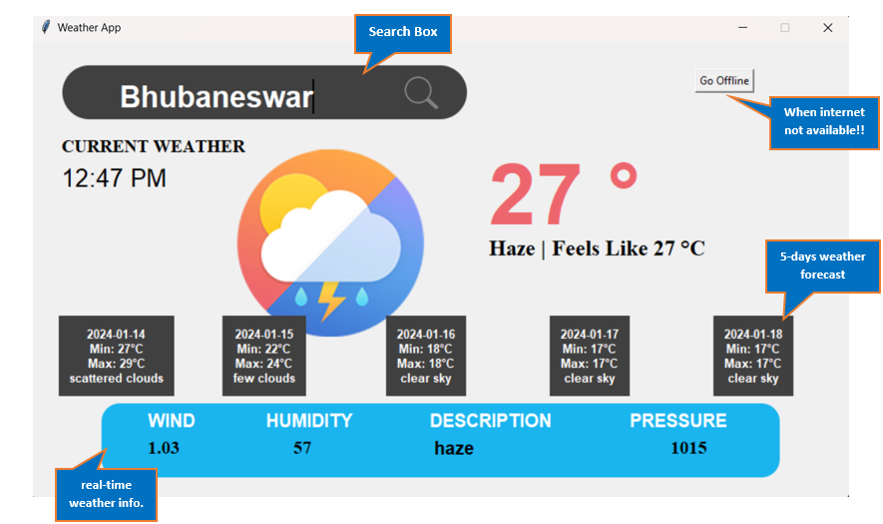
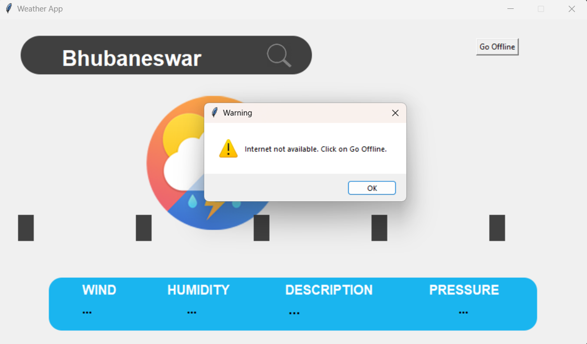

# Weather App

## Overview

Weather App is a simple yet effective Python application built with Tkinter, a GUI framework, to provide users with real-time weather information for their specified cities. The app fetches current weather conditions and a 5-day forecast, displaying key details such as temperature, wind speed, humidity, and more.

## Features

- **User-Friendly Interface:** The app features a clean and intuitive interface designed using Tkinter, making it easy for users to input cities and obtain weather information.

- **Real-time Data:** Utilizing OpenWeatherMap API, the app fetches real-time weather data, including current conditions and a 5-day forecast, ensuring users stay updated.

- **Offline Mode:** The app includes an offline mode, allowing users to check the last fetched weather data for a specific city even without an internet connection.

## Screenshots




## How to Use

1. Clone the repository to your local machine.
   ```bash
   git clone https://github.com/yogita-2708/weather-app.git
   ```

2. Install the required Python libraries.
   ```bash
   pip install
   ```

3. Run the application.
   ```bash
   python weather_app.py
   ```

## Dependencies

- Tkinter
- Geopy
- Timezonefinder
- Requests
- Pytz

## Acknowledgments

- Thanks to OpenWeatherMap for providing the weather data API.
